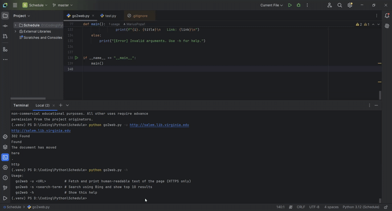

# Lab 5 - Websockets

by Popa Marius - FAF-222

## Project Overview
This laboratory is about creating a command line program.

## Features
- **go2web -u url** - make an HTTP request to the specified URL and print the response
- **go2web -s search-term** - make an HTTP request to search the term using your favorite search engine and print top 10 results
- **go2web -h** - show this help

The responses from request should be human-readable (e.g. no HTML tags in the output)

## Technologies Used
- **Python** for main program
- **Git & GitHub** for version control
- **Pycharm terminal** for CLI
## GIF
